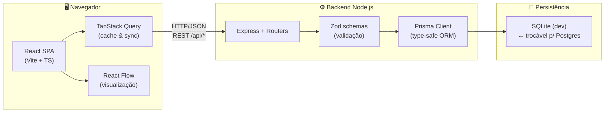
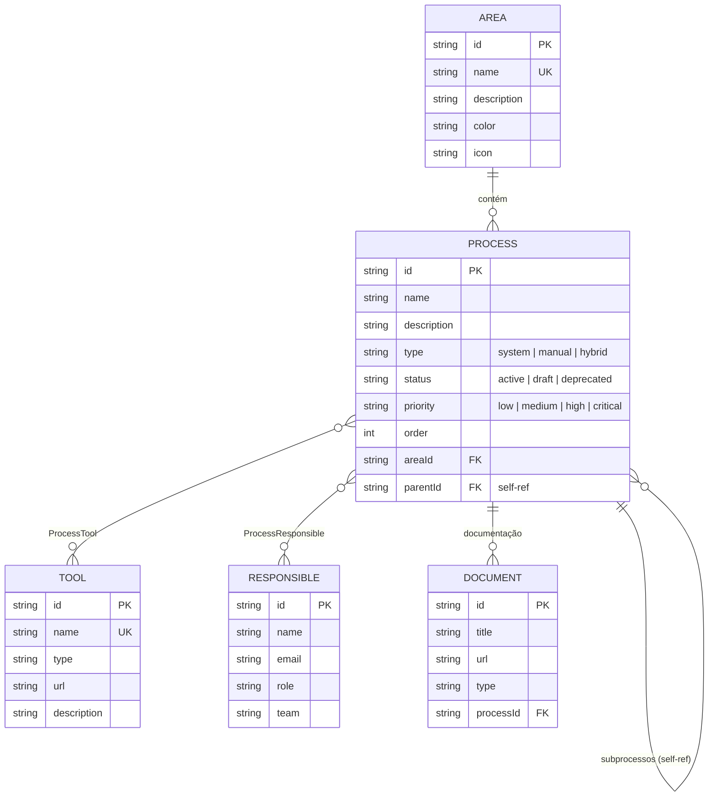
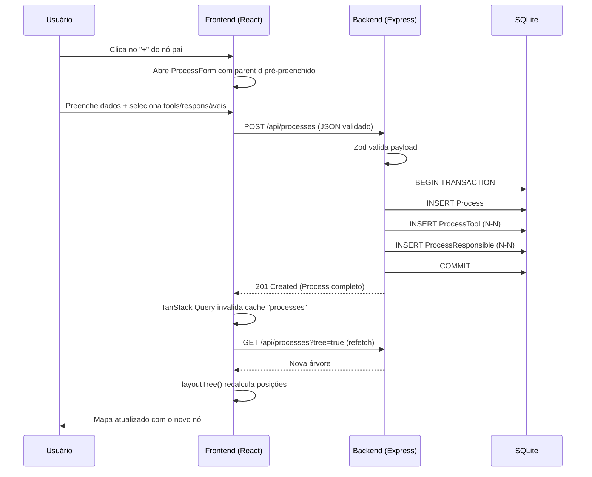

# Arquitetura — ProcessMap

Documento técnico complementar ao [README.md](../README.md).

## Visão em camadas (Mermaid)



## Modelo Entidade-Relacionamento



## Fluxo de criação de subprocesso



## Algoritmo de layout (árvore)

Implementação em [`frontend/src/components/processMap/layout.ts`](../frontend/src/components/processMap/layout.ts).

**Pseudocódigo:**

```
function measure(node):
  if node.children == empty:
    return NODE_HEIGHT
  return sum(measure(child) + V_GAP) - V_GAP

function place(node, depth, yStart):
  height = measure(node)
  position = (depth * (NODE_WIDTH + H_GAP), yStart + height/2 - NODE_HEIGHT/2)
  emit(node, position)
  childY = yStart
  for child in node.children:
    place(child, depth + 1, childY)
    emit(edge: node → child)
    childY += measure(child) + V_GAP
```

Complexidade: **O(n)** com `n = total de nós`. Sem dependência externa
(Dagre/Elk) — a árvore tem topologia previsível, então um cálculo recursivo
em pós-ordem é suficiente e legível.

## Decisões de design

| Tópico | Decisão | Motivação |
|---|---|---|
| Estado servidor | TanStack Query | Cache automático, invalidação por chave, refetch transparente |
| Hierarquia | Auto-referência (`parentId`) | Suporta árvores ilimitadas sem JOIN dinâmico |
| Transação em update | `prisma.$transaction` | Vínculos N-N precisam ser atômicos |
| Validação dupla | Zod (server) + form state (client) | Server é fonte de verdade; client melhora UX |
| Estilo | Tailwind com tokens custom | Sem CSS-in-JS runtime, bundle menor |
| Visualização | React Flow + nó custom | Handles nativos, MiniMap, edges customizáveis |
| Layout | Algoritmo próprio | Sem peso extra de Dagre/Elk |
| Cores semânticas | `meta.ts` central | Mudanças de paleta em 1 arquivo |
